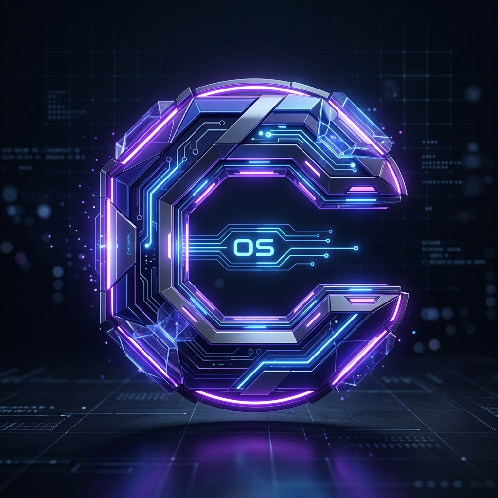

<div align="center">
  
  
  # CreatorOS AI
  
  **The Ultimate Operating System for Digital Creators**
  
  [](https://nextjs.org/)
  [](https://supabase.com/)
  [](https://tailwindcss.com/)
  [](https://www.typescriptlang.org/)
  
  *Turn a single idea into scripts, voiceovers, videos, thumbnails, and captions. Publish everywhere — automatically.*
</div>

---

## 🚀 Overview

**CreatorOS AI** is a fully automated, AI-driven content generation engine designed to scale your educational content empire. Built for YouTubers, educators, and digital marketers, it eliminates the friction of content creation by generating production-ready media from simple text prompts.

### 🌟 Key Features

- 🧠 **AI Script & Lesson Generator**: Leverage powerful LLMs (Gemini / Ollama) to instantly draft highly structured, engaging educational scripts.
- 🎙️ **Voice Studio**: Generate ultra-realistic, studio-quality AI voiceovers.
- 👤 **Avatar Studio (D-ID Integration)**: Transform your scripts and voiceovers into talking-head videos with lifelike AI avatars.
- 🖼️ **Thumbnail Generator**: Automatically design eye-catching, high-converting YouTube thumbnails.
- 📝 **Auto-Captions**: Generate accurate captions for accessibility and better audience retention.
- 🚀 **YouTube Auto-Publish**: Connect your channel and directly schedule or publish your AI-generated videos to YouTube.
- 🔐 **Secure Authentication**: Passwordless OTP flow backed by EmailJS and Supabase.

---

## 💻 Tech Stack

- **Frontend**: Next.js 14 (App Router), React, Tailwind CSS, Lucide Icons, Recharts
- **Backend & Database**: Supabase (PostgreSQL, Auth, Storage)
- **AI Models**: Google Gemini API / Ollama (Local Fallback)
- **Video/Avatar Generation**: D-ID API
- **Emails**: EmailJS
- **Deployment**: Vercel

---

## 🛠️ Quick Start

### 1. Clone the repository
```bash
git clone https://github.com/AbdulAhad0007/creatoros.git
cd creatoros/creatoros-web
```

### 2. Configure Environment Variables
Create a `.env` file in the `creatoros-web` directory and add your keys:
```env
# Supabase Configuration
NEXT_PUBLIC_SUPABASE_URL="your_supabase_url"
NEXT_PUBLIC_SUPABASE_ANON_KEY="your_supabase_anon_key"

# Database Connection Strings
POSTGRES_URL="your_postgres_url"

# AI & APIs
GEMINI_API_KEY="your_gemini_key"
D_ID_API_KEY="your_did_key"

# EmailJS Configuration (Auth OTP)
NEXT_PUBLIC_EMAILJS_SERVICE_ID="your_service_id"
NEXT_PUBLIC_EMAILJS_TEMPLATE_ID="your_template_id"
NEXT_PUBLIC_EMAILJS_PUBLIC_KEY="your_public_key"
NEXT_PUBLIC_EMAILJS_PRIVATE_KEY="your_private_key"
```
*(Note: Keep your `.env` file out of source control. It is explicitly ignored in `.gitignore` to prevent secret leaks!)*

### 3. Install Dependencies
```bash
npm install
```

### 4. Run the Development Server
```bash
npm run dev
```
Open [http://localhost:3000](http://localhost:3000) to view the application.

---

## 📱 Responsiveness & Design

CreatorOS AI features a premium "Glassmorphism" design aesthetic, utilizing blurred backdrops, glowing neon accents, and sleek typography. The entire dashboard and public landing pages are fully responsive, scaling perfectly from 4k desktop monitors down to mobile devices.

---

## 🤝 Contributing

We welcome contributions! Feel free to open an issue or submit a Pull Request if you'd like to help improve CreatorOS.

---

<div align="center">
  <p>Built with 💙 by creators, for creators.</p>
</div>
